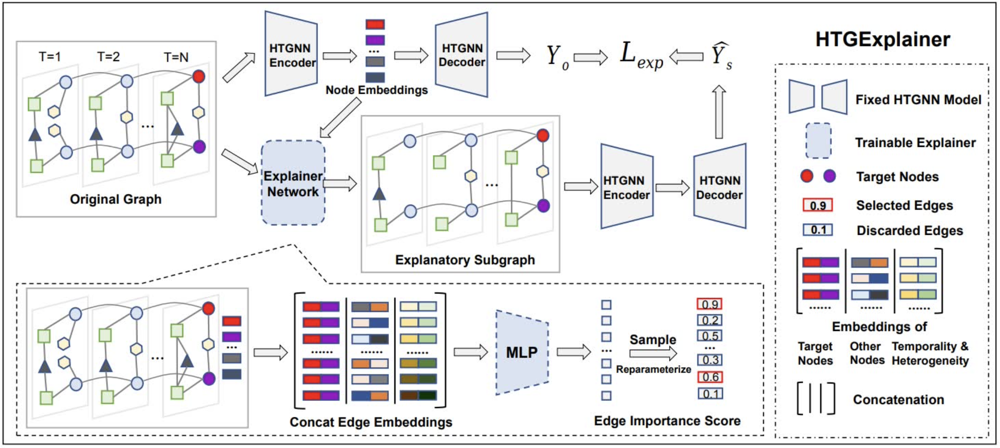

# HTGExplainer

This repo is the pytorch implementation of the paper [Heterogeneous Temporal Graph Neural Network Explainer](https://dl.acm.org/doi/10.1145/3583780.3614909) accepted in CIKM '23.

## Model Architecture



## Setup

```python
conda create -n HTGExplainer python=3.10
conda activate HTGExplainer
conda install -r requirements.txt
```

## Datasets
We used three datasets in our experiments: Covid19, OGBN-MAG and MovieLens.
Please download and unzip all the files from [link](https://drive.google.com/drive/folders/12w7E1utk4buXjCXw59KK532Q8Mf4Ig7C?usp=sharing) and put them under `data/` folder.

## Usage

Note that we use [HTGNN](https://github.com/YesLab-Code/HTGNN) as our to-be-explained heterogeneous temporal graph neural network, and we include their original code and model checkpoints under `HTGNN/` folder (we thank authors for their great work and code). Feel free to modify it or use your own GNN models.

To use HTGExplainer model, please run (take MovieLens as an example):
```
python explainer_ml.py [--he HE] [--te TE] [--khop KHOP] ...


optional arguments:
--he    which heterogeneous embedding methods to use (options: 'onehot', 'learnable')
--te    which temporal embedding methods to use (options: 'pos', 'cos')
--khop  how many hop neighbors as local graphs to generate explanory subgraphs (options: 1, 2)
...
```

## Citation
Please consider citing our paper if you found it helpful! :)

```bibtex
@inproceedings{HTGExplainer,
author = {Li, Jiazheng and Zhang, Chunhui and Zhang, Chuxu},
title = {Heterogeneous Temporal Graph Neural Network Explainer},
year = {2023},
booktitle = {Proceedings of the 32nd ACM International Conference on Information and Knowledge Management (CIKM)},
}
```
